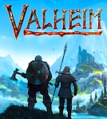
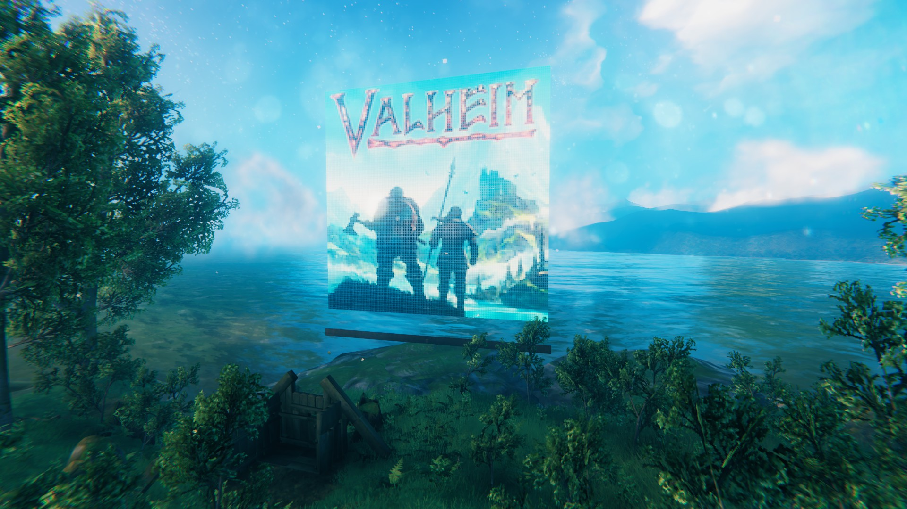

# img2bpl.pl
Script for converting image file to Valheim blueprint (suitable for using with PlanBuild mod)

**Usage**:
img2bpl.pl image_file blueprint_name > blueprint_name.blueprint

**Requirements**: 
Perl, perl module Image::Magick

**Notes**: Preferably, the vertical resolution of the picture should be a multiple of three (otherwise one or two lines will be lost). Also, PlanBuild can only use the generated blueprints only in direct mode (because the labels on the signs will be lost during building in normal mode). If immediately after construction the image does not look quite correct, try to move away a distance sufficient for it to disappear, and then return.

**Example of conversion**: 

may be converted into follow structure

